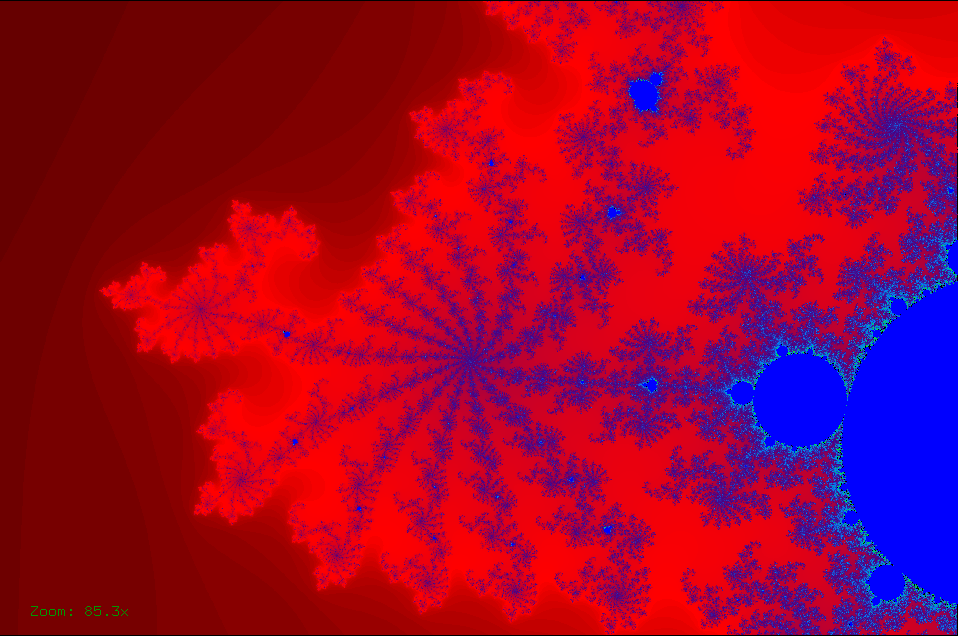

# Mandel

Mandel is an interactive viewer for the Mandelbrot set. You can zoom into any area of the set by simply clicking and dragging the mouse to highlight the desired area. At any time, the user can press 'r' to return to the full image.

To run this program, the GLUT library (a package of OpenGL) needs to be added. Put the glut32.lib file in the 'lib' directory, and the glut32.dll file in the 'bin' directory. The rest of the GLUT files need to go into your compiler's directory (ex. C:\MinGW\include)